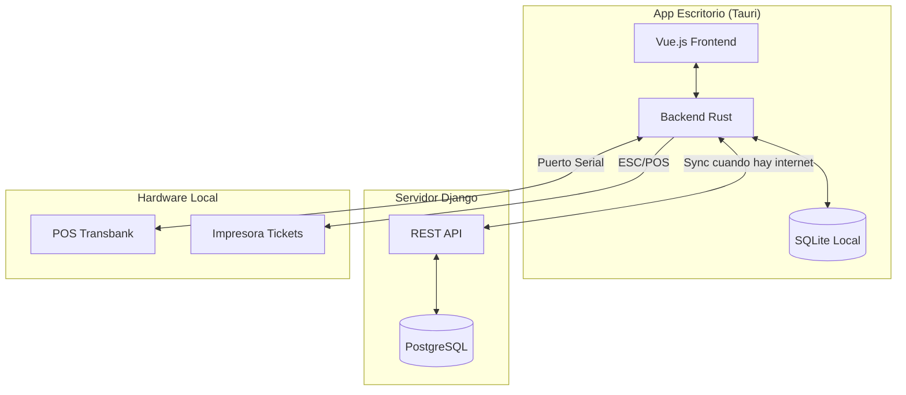
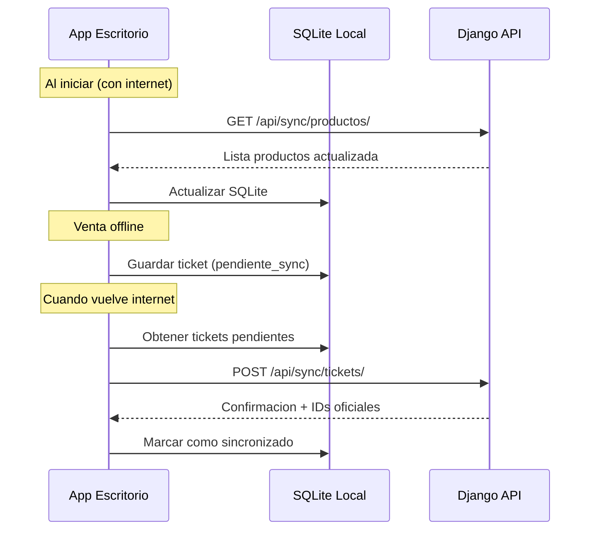

# Plan: Aplicacion de Escritorio para Modulo de Ventas

## Recomendacion de Tecnologia: Tauri + Vue.js

**Por que Tauri en lugar de Electron:**

| Aspecto | Tauri | Electron |

|---------|-------|----------|

| Tamano ejecutable | ~10-15 MB | ~150+ MB |

| Uso de RAM | ~30-50 MB | ~150-300 MB |

| Velocidad inicio | Instantaneo | 2-5 segundos |

| Acceso serial (Transbank) | Nativo en Rust | Requiere plugins |

| Aspecto profesional | Mas fluido | Puede sentirse lento |

**Por que Vue.js para el frontend:**

- Facil de aprender si ya conoces HTML/JS
- Puede reutilizar estilos CSS del sistema NEXO existente
- Excelente para apps reactivas

---

## Arquitectura General



---

## Modo Offline - Como Funcionara

### Datos que se sincronizan localmente:

1. **Productos** (codigo, nombre, precio, stock)
2. **Categorias**
3. **Tallas/Variantes**
4. **Configuracion de caja/sucursal**
5. **Vendedores**

### Operaciones offline:

1. **Consultar productos/precios** - Desde SQLite local
2. **Generar ventas/tickets** - Se guardan localmente con estado "pendiente_sync"
3. **Pagos en efectivo** - Funcionan sin conexion
4. **Pagos con tarjeta** - Requieren conexion (Transbank necesita internet)

### Sincronizacion:



---

## Estructura del Proyecto

```
retailmind-desktop/
├── src-tauri/                    # Backend Rust
│   ├── src/
│   │   ├── main.rs               # Punto de entrada
│   │   ├── commands/             # Comandos invocables desde JS
│   │   │   ├── ventas.rs         # Logica de ventas
│   │   │   ├── productos.rs      # Consultas productos
│   │   │   ├── sync.rs           # Sincronizacion
│   │   │   └── transbank.rs      # Integracion POS
│   │   ├── db/
│   │   │   ├── mod.rs
│   │   │   └── schema.rs         # Esquema SQLite
│   │   └── serial/
│   │       └── pos.rs            # Comunicacion serial Transbank
│   ├── Cargo.toml
│   └── tauri.conf.json
│
├── src/                          # Frontend Vue.js
│   ├── components/
│   │   ├── ProductoCard.vue
│   │   ├── CarritoVenta.vue
│   │   ├── TecladoNumerico.vue
│   │   └── ModalPago.vue
│   ├── views/
│   │   ├── PuntoVenta.vue        # Vista principal POS
│   │   ├── Productos.vue         # Catalogo
│   │   ├── Cuadratura.vue        # Cierre de caja
│   │   └── Configuracion.vue
│   ├── stores/
│   │   ├── venta.js              # Estado del carrito
│   │   └── config.js             # Configuracion
│   ├── api/
│   │   └── tauri-bridge.js       # Comunicacion con Rust
│   └── assets/
│       └── styles/
│           └── nexo-theme.css    # Tema NEXO
│
├── package.json
└── README.md
```

---

## API REST para Sincronizacion (Django)

Nuevos endpoints necesarios en el backend Django:

```python
# Endpoints a crear en retailmind/app/urls.py

# Sincronizacion
/api/v1/sync/productos/          # GET - Productos con cambios desde fecha
/api/v1/sync/categorias/         # GET - Categorias
/api/v1/sync/tickets/            # POST - Subir tickets offline
/api/v1/sync/status/             # GET - Estado de sincronizacion

# Autenticacion desktop
/api/v1/desktop/login/           # POST - Login y obtener token
/api/v1/desktop/sucursal/        # GET - Info sucursal configurada
```

---

## Fases de Implementacion

### Fase 1: Infraestructura Base (1-2 semanas)

- Crear proyecto Tauri + Vue.js
- Configurar SQLite local con esquema basico
- Implementar API REST de sincronizacion en Django
- Sistema de autenticacion para la app desktop

### Fase 2: Modulo de Ventas Core (2-3 semanas)

- Vista de punto de venta (POS)
- Busqueda y seleccion de productos
- Carrito de compras
- Calculo de totales y descuentos
- Generacion de tickets locales
- Impresion de tickets (ESC/POS)

### Fase 3: Integracion Transbank (1 semana)

- Comunicacion serial con POS Transbank
- Flujo de pago con tarjeta
- Manejo de respuestas y errores
- Voucher de transaccion

### Fase 4: Sincronizacion Offline (1-2 semanas)

- Sincronizacion de productos/precios
- Cola de tickets pendientes
- Resolucion de conflictos
- Indicador de estado de conexion

### Fase 5: Funcionalidades Adicionales (1-2 semanas)

- Cuadratura de caja
- Cambios y devoluciones
- Reportes basicos
- Configuracion de sucursal

---

## Consideraciones Importantes

### Respecto a la sugerencia de hacer esto:

**SI lo recomiendo** por estas razones:

1. **Rendimiento**: Una app nativa es mas rapida que el navegador
2. **Acceso a hardware**: Impresoras y POS Transbank funcionan mejor con acceso directo
3. **Modo offline**: Critico para retail - no perder ventas por caida de internet
4. **UX profesional**: Pantalla completa dedicada, atajos de teclado, sin distracciones del navegador

**Desafios a considerar:**

1. **Mantenimiento**: Tendras 2 sistemas (web + desktop)
2. **Actualizaciones**: Necesitas mecanismo de auto-update
3. **Sincronizacion**: La logica offline/online agrega complejidad

### Archivos Django a modificar:

- [`retailmind/app/urls.py`](retailmind/app/urls.py) - Agregar rutas API
- [`retailmind/app/models.py`](retailmind/app/models.py) - Campo `synced_at` en Ticket
- Crear nuevo archivo `retailmind/app/api_desktop.py` para los endpoints

---

## Resultado Final Esperado

Una aplicacion de escritorio que:

- Se instala como `.exe` en Windows
- Inicia en 1-2 segundos
- Funciona sin internet para ventas en efectivo
- Se sincroniza automaticamente cuando hay conexion
- Procesa pagos con tarjeta via Transbank
- Imprime tickets directamente
- Usa el mismo look and feel NEXO del sistema web