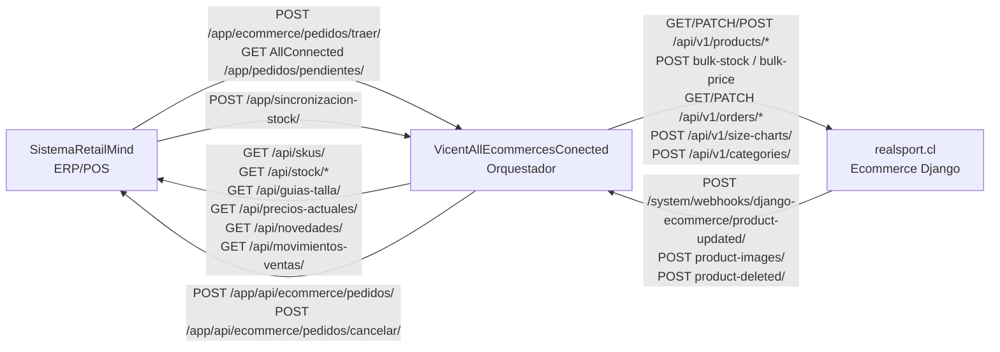

# Analisis de integracion: SistemaRetailMind, VicentAllEcommercesConected y realsport.cl

## 0. Resumen para otra IA

Este documento describe solo los endpoints y disparadores que conectan estos tres sistemas:

- `SistemaRetailMind`: ERP/POS Django. Es fuente de catalogo, stock, precios, sucursales y movimientos de venta. Tambien recibe pedidos ecommerce para facturarlos.
- `VicentAllEcommercesConected`: orquestador omnicanal. Es el sistema central de integracion. Lee RetailMind, lee/escribe realsport.cl, recibe webhooks y propaga stock/precios/pedidos.
- `realsport.cl`: ecommerce Django publico. Expone API REST a AllConnected y notifica cambios de productos/imagenes a AllConnected.

Regla mental principal:

```text
RetailMind es el ERP de verdad para stock/catalogo.
AllConnected es el orquestador que traduce y propaga.
realsport.cl es un canal ecommerce conectado por API.
```

No se revisan endpoints internos de dashboards, admin o UI salvo cuando disparan una integracion externa.

## 1. Diagrama de flujo alto nivel



## 2. Direcciones de comunicacion

### 2.1 RetailMind -> AllConnected

| Flujo | Quien llama | Quien recibe | Endpoint | Auth | Disparador | Implementacion |
|---|---|---|---|---|---|---|
| Pull de pedidos pendientes | RetailMind | AllConnected | `GET /app/pedidos/pendientes/` | `X-AllConnected-Key` | Boton `POST /app/ecommerce/pedidos/traer/` en RetailMind | RM: `retailmind/app/services/allconnected_pedidos_service.py`; AC: `system/orders/retailmind_connector.py:325` |
| Push de stock modificado | RetailMind | AllConnected | `POST /app/sincronizacion-stock/` | Sin auth en receptor actual | Venta/devolucion/ajuste que invoque `stock_notifier` | RM: `retailmind/app/stock_notifier.py:81`; AC: `system/webhooks/views.py:1672` |

Notas:

- El pull de pedidos no crea pedidos por si mismo en AllConnected; RetailMind consulta a AllConnected y luego ingesta localmente con `_ingestar_pedido_dict`.
- El push de stock manda `productos: [{sku, new_stock}]` y preferentemente `rut_empresa`; `idCanalOrigen` queda como fallback legacy.
- `ALLCONNECTED_WEBHOOK_URL`, `ALLCONNECTED_API_BASE_URL`, `ALLCONNECTED_API_KEY`, `ALLCONNECTED_API_HEADER_NAME` y `ALLCONNECTED_PEDIDOS_PATH` viven en settings de RetailMind (`retailmind/retailmind/settings.py:621`, `:634-637`).

### 2.2 AllConnected -> RetailMind

| Flujo | Quien llama | Quien recibe | Endpoint | Auth | Disparador | Implementacion |
|---|---|---|---|---|---|---|
| Catalogo completo | AllConnected | RetailMind | `GET /api/skus/?rut_empresa=...` | `Authorization: Bearer` o `X-Api-Key` | Sync completa RetailMind | RM `SkusPorEmpresaView`, `retailmind/app/api/external/views.py:90`; AC client `system/marketplaces/retailmind/client.py` |
| Tallas por articulo | AllConnected | RetailMind | `GET /api/articulos/<codigo>/tallas/?rut_empresa=...` | Bearer o `X-Api-Key` | Refresco puntual | RM `TallasPorArticuloView`, `views.py:178` |
| Stock incremental | AllConnected | RetailMind | `GET /api/stock/movimientos/?rut_empresa=...&fecha_desde=YYYY-MM-DD` | Bearer o `X-Api-Key` | Sync rapida | RM `StockMovimientosView`, `views.py:223` |
| Stock por SKUs y sucursal | AllConnected | RetailMind | `GET /api/stock/por-skus/?rut_empresa=...&skus=A,B` | Bearer o `X-Api-Key` | Resolver sucursal para pedido | RM `StockPorSkusView`, `views.py:281` |
| Stock global | AllConnected | RetailMind | `GET/POST /api/stock/global/` | Bearer o `X-Api-Key` | Sync stock masivo a ecommerce | RM `StockGlobalView`, `views.py:352` |
| Sucursales | AllConnected | RetailMind | `GET /api/sucursales/?rut_empresa=...` | Bearer o `X-Api-Key` | Configuracion de canal RM | RM `SucursalesPorEmpresaView`, `views.py:486` |
| Guias de talla | AllConnected | RetailMind | `GET /api/guias-talla/?rut_empresa=...` | Bearer o `X-Api-Key` | Importar guias | RM `GuiasTallaExternalView`, `views.py:539` |
| Precios actuales | AllConnected | RetailMind | `GET /api/precios-actuales/?rut_empresa=...` | Bearer o `X-Api-Key` | Motor descuentos/precios | RM `PreciosActualesView`, `views.py:658` |
| Novedades | AllConnected | RetailMind | `GET /api/novedades/?rut_empresa=...&desde=YYYY-MM-DD` | Bearer o `X-Api-Key` | Sync incremental catalogo | RM `NovedadesView`, `views.py:931` |
| Movimientos de venta | AllConnected | RetailMind | `GET /api/movimientos-ventas/?rut_empresa=...&fecha_desde=...` | Bearer o `X-Api-Key` | Devoluciones / consulta ventas | RM `MovimientosVentasView`, `views.py:1036` |
| Push pedido a facturar | AllConnected | RetailMind | `POST /app/api/ecommerce/pedidos/` | `X-RetailMind-Key` | Pedido nuevo sincronizable | RM `api_recibir_pedido_ecommerce`, `retailmind/app/views_ecommerce.py:433`; AC `asignar_ticket_rm`, `system/orders/retailmind_connector.py:180` |
| Consulta ticket RM | AllConnected | RetailMind | `GET /app/api/ecommerce/pedidos/consultar/?numero_ticket_rm=...` | `X-RetailMind-Key` | Consulta estado | RM `api_asignar_ticket_rm`, `views_ecommerce.py:481` |
| Cancelacion de pedido | AllConnected | RetailMind | `POST /app/api/ecommerce/pedidos/cancelar/` | `X-RetailMind-Key` | Pedido cancelado en canal | RM `api_cancelar_pedido_ecommerce`, `views_ecommerce.py:517`; AC `notificar_cancelacion_rm`, `retailmind_connector.py:272` |

Notas:

- La API externa de RetailMind esta montada en `retailmind/retailmind/urls.py:41` como `path('api/', include('app.api.external.urls'))`.
- La auth de API externa acepta dos formatos: `Authorization: Bearer {RETAILMIND_API_KEY}` y `X-Api-Key: {RETAILMIND_API_KEY}` (`retailmind/app/api/external/authentication.py`).
- La API de pedidos ecommerce de RetailMind usa otro header: `X-RetailMind-Key` (`retailmind/app/views_ecommerce.py:256`).
- El payload de pedido es compartido entre push y pull; se crea con `construir_payload_pedido_rm` en AllConnected (`system/orders/retailmind_connector.py:61`) y se ingesta con `_ingestar_pedido_dict` en RetailMind (`retailmind/app/views_ecommerce.py:278`).

### 2.3 AllConnected -> realsport.cl

| Flujo | Quien llama | Quien recibe | Endpoint | Auth | Disparador | Implementacion |
|---|---|---|---|---|---|---|
| Listar productos | AllConnected | realsport | `GET /api/v1/products/?updated_since=&page=&page_size=` | `X-AllConnected-Key` | Import/sync productos | RS `ProductViewSet`, `apps/api/views.py:96`; AC `DjangoEcommerceClient.list_products`, `system/marketplaces/django_ecommerce/client.py:128` |
| Crear producto | AllConnected | realsport | `POST /api/v1/products/` | `X-AllConnected-Key` | Publicacion desde RM/AC | RS `ProductViewSet.create`; AC `create_product`, `client.py:150` |
| Detalle producto | AllConnected | realsport | `GET /api/v1/products/<sku>/` | `X-AllConnected-Key` | Verificacion/preflight | AC `get_product`, `client.py:142` |
| Actualizar producto | AllConnected | realsport | `PATCH /api/v1/products/<sku>/` | `X-AllConnected-Key` | Publicacion, tallas, precio individual | AC `update_product`, `client.py:162` |
| Stock masivo | AllConnected | realsport | `POST /api/v1/products/bulk-stock/` | `X-AllConnected-Key` | Sync stock RM -> realsport | RS `bulk_stock`, `apps/api/views.py:138`; AC `bulk_update_stock`, `client.py:170` |
| Precios masivos | AllConnected | realsport | `POST /api/v1/products/bulk-price/` | `X-AllConnected-Key` | Tareas de precios/descuentos | RS `bulk_price`, `apps/api/views.py:225`; AC `bulk_update_price`, `client.py:201` |
| Imagenes por URL | AllConnected | realsport | `POST /api/v1/products/<sku>/images/` | `X-AllConnected-Key` | Publicacion/diagnostico fotos | RS `add_images`, `apps/api/views.py:389`; AC `add_images_from_urls`, `client.py:256` |
| Portadas | AllConnected | realsport | `GET /api/v1/products/images/?skus=...` o paginado | `X-AllConnected-Key` | Sync/verificacion imagenes | RS `product_cover_images_view`, `apps/api/views.py:671` |
| Listar pedidos | AllConnected | realsport | `GET /api/v1/orders/?updated_since=&status=` | `X-AllConnected-Key` | Polling pedidos ecommerce | RS `OrderViewSet`, `apps/api/views.py:461`; AC `list_orders`, `client.py:281` |
| Detalle pedido | AllConnected | realsport | `GET /api/v1/orders/<number>/` | `X-AllConnected-Key` | Debug/verificacion | AC `get_order`, `client.py:299` |
| Actualizar pedido | AllConnected | realsport | `PATCH /api/v1/orders/<number>/` | `X-AllConnected-Key` | Tracking/estado | AC `update_order`, `client.py:308` |
| Estado masivo pedidos | AllConnected | realsport | `GET/POST /api/v1/orders/statuses/` | `X-AllConnected-Key` | Refresh lote de estados | RS `statuses`, `apps/api/views.py:493` |
| Guias de talla | AllConnected | realsport | `GET/POST/PATCH /api/v1/size-charts/` | `X-AllConnected-Key` | Upsert guias y asignacion a producto | RS `SizeChartViewSet`, `apps/api/views.py:626`; AC `upsert_size_chart`, `client.py:337` |
| Categorias | AllConnected | realsport | `GET/POST /api/v1/categories/` | `X-AllConnected-Key` | Crear/validar categoria | RS `categories_view`, `apps/api/views.py:581`; AC `ensure_category`, `client.py:325` |
| Health | AllConnected | realsport | `GET /api/v1/health/` | Sin auth | Diagnostico | RS `health_view`, `apps/api/views.py:665` |

Notas:

- La API esta montada en realsport como `path("api/v1/", include("apps.api.urls"))` (`config/urls.py:33`).
- El router DRF registra `products`, `orders` y `size-charts`; `categories`, `products/images` y `health` van por paths explicitos (`apps/api/urls.py:13-23`).
- La auth de realsport es `X-AllConnected-Key` contra `ALLCONNECTED_API_KEY` (`apps/api/auth.py`).
- `bulk-price` marca `_skip_allconn_push=True` antes de guardar producto para evitar webhook de vuelta hacia AllConnected (`apps/api/views.py:354-364`).

### 2.4 realsport.cl -> AllConnected

| Flujo | Quien llama | Quien recibe | Endpoint | Auth | Disparador | Implementacion |
|---|---|---|---|---|---|---|
| Producto creado/editado | realsport | AllConnected | `POST /system/webhooks/django-ecommerce/product-updated/` | `X-AllConnected-Key` | `post_save(Product)` | RS `on_product_saved`, `apps/api/signals.py:95`; task `push_producto_actualizado`, `apps/api/tasks.py:30`; AC handler `system/webhooks/views.py:2545` |
| Imagenes actualizadas | realsport | AllConnected | `POST /system/webhooks/django-ecommerce/product-images/` | `X-AllConnected-Key` | `post_save/post_delete(ProductImage)` | RS `on_image_saved`, `apps/api/signals.py:78`; task `push_imagenes_producto`, `apps/api/tasks.py:54`; AC handler `system/webhooks/views.py:2439` |
| Producto eliminado | realsport | AllConnected | `POST /system/webhooks/django-ecommerce/product-deleted/` | `X-AllConnected-Key` | `post_delete(Product)` | RS `on_product_deleted`, `apps/api/signals.py:117`; task `push_producto_eliminado`, `apps/api/tasks.py:76`; AC handler `system/webhooks/views.py:2690` |

Notas:

- Las URLs salientes viven en realsport: `ALLCONNECTED_WEBHOOK_URL`, `ALLCONNECTED_PRODUCT_UPDATED_URL`, `ALLCONNECTED_PRODUCT_DELETED_URL`.
- Las notificaciones son asincronas por Celery y reintentan hasta 3 veces.
- Las senales usan `transaction.on_commit` para evitar avisar cambios que hicieron rollback.
- Operaciones originadas desde AllConnected pueden suprimir eco con `_skip_allconn_push`.

## 3. Contratos de datos principales

### 3.1 Catalogo RetailMind -> AllConnected

Endpoint principal:

```http
GET /api/skus/?rut_empresa=XXXXXXXX-X
Authorization: Bearer <RETAILMIND_API_KEY>
```

Respuesta:

```json
{
  "success": true,
  "data": [
    {
      "articulo": "CODIGO_ARTICULO",
      "marca": "Nike",
      "color": "Negro",
      "genero": "Hombre",
      "categoria": "Zapatillas",
      "tallas": [
        {
          "sku": "4810070",
          "talla": "40",
          "total_stock": 5,
          "sucursales": [{"nombre": "PAO1", "stock": 5}]
        }
      ]
    }
  ],
  "total": 1,
  "error": null
}
```

Consumidor: `RetailMindClient.obtener_skus_por_empresa`, que acepta formato anidado o plano y normaliza a SKUs (`system/marketplaces/retailmind/client.py`).

### 3.2 Stock RetailMind -> AllConnected -> realsport

Flujo pull/batch:

```text
AllConnected lee RM /api/stock/global/
AllConnected calcula diff local contra ProductoCanal/VariacionCanal
AllConnected llama realsport POST /api/v1/products/bulk-stock/
AllConnected actualiza stock_canal local si el push fue OK
```

Endpoint RM:

```http
GET /api/stock/global/?rut_empresa=XXXXXXXX-X&skus=4810070,4810071
POST /api/stock/global/
Body: {"rut_empresa": "XXXXXXXX-X", "skus": ["4810070"]}
```

Endpoint realsport:

```json
{
  "updates": [
    {
      "sku": "ARTICULO_PADRE",
      "stock": 20,
      "variants": [{"sku": "4810070", "stock": 5}]
    }
  ]
}
```

Implementacion operativa visible: `system/management/commands/sync_stock_realsport.py`.

### 3.3 Pedido realsport -> AllConnected -> RetailMind

Flujo normal:

```text
AllConnected poll GET /api/v1/orders/ en realsport
AllConnected crea/actualiza Pedido + DetallePedido
AllConnected intenta asignar ticket RM con POST /app/api/ecommerce/pedidos/
RetailMind crea PedidoEcommerce idempotente
RetailMind devuelve numero_ticket_rm
AllConnected guarda numero_ticket_rm
```

Payload hacia RetailMind:

```json
{
  "numero_pedido": "DJA-...",
  "numero_pedido_canal": "ORD-2026-00012",
  "canal_origen": "DJANGO_ECOMMERCE",
  "sucursal_id": 3,
  "rut_empresa": "76104936-4",
  "cliente_nombre": "Cliente",
  "cliente_email": "cliente@example.com",
  "cliente_documento": "",
  "subtotal": 19990,
  "descuento": 0,
  "impuestos": 0,
  "costo_envio": 2990,
  "total": 22980,
  "items": [
    {"sku": "4810070", "nombre": "Producto", "cantidad": 1, "precio_unitario": 19990}
  ],
  "direccion_envio": "Direccion texto plano"
}
```

Reglas criticas:

- Idempotencia en RetailMind por `(canal_origen, numero_pedido_canal)`.
- AllConnected filtra pedidos que ya tienen `numero_ticket_rm`.
- RetailMind valida que `sucursal_id` pertenezca al `rut_empresa` del payload.
- `total` debe tratarse como monto final autoritativo; no recalcular desde subtotal/descuento/impuestos/envio.

### 3.4 Pull de pedidos pendientes AllConnected -> RetailMind

Aunque el boton esta en RetailMind, el endpoint remoto vive en AllConnected:

```http
GET {ALLCONNECTED_API_BASE_URL}/app/pedidos/pendientes/?estado=PENDIENTE&rut_empresa=...&desde=YYYY-MM-DD&hasta=YYYY-MM-DD
X-AllConnected-Key: <ALLCONNECTED_API_KEY>
```

Respuesta:

```json
{
  "ok": true,
  "pedidos": [],
  "total": 0,
  "omitidos": 0,
  "omitidos_detalle": [],
  "desde": "2026-06-01",
  "hasta": "2026-06-11"
}
```

Detalles:

- `estado=PENDIENTE` significa "sin `numero_ticket_rm`", no necesariamente `Pedido.estado == PENDIENTE`.
- Excluye cancelados/devueltos/reembolsados antes de construir payload.
- `omitidos_detalle` es aditivo y ayuda a diagnosticar canal sin sucursal, sin RUT, fuera de fecha de inicio, etc.

## 4. Disparadores automaticos y manuales

| Tipo | Sistema | Disparador | Efecto externo |
|---|---|---|---|
| Senal `post_save(Product)` | realsport | Guardar producto | Encola webhook `product-updated` a AllConnected |
| Senal `post_save/post_delete(ProductImage)` | realsport | Cambiar imagenes | Encola webhook `product-images` a AllConnected |
| Senal `post_delete(Product)` | realsport | Eliminar producto | Encola webhook `product-deleted` a AllConnected |
| Celery task | realsport | Webhooks salientes | Hace POST a AllConnected con retry |
| Boton UI | RetailMind | `/app/ecommerce/pedidos/traer/` | Pull de pedidos pendientes desde AllConnected |
| Funcion/servicio | RetailMind | `stock_notifier` | POST stock a AllConnected |
| Pedido importado | AllConnected | `DjangoEcommerceOrderSyncService` | Puede notificar a RetailMind con `asignar_ticket_rm` |
| Cancelacion pedido | AllConnected | signal o flujo pedido | Fire-and-forget a RM `/cancelar/` |
| Comando/manual | AllConnected | `sync_stock_realsport` | Lee stock RM y empuja `bulk-stock` a realsport |
| Tareas precios | AllConnected | `system/precios/tasks.py` | Empuja `bulk-price` a realsport |
| Publicacion producto | AllConnected | Publisher django_ecommerce | POST/PATCH producto, categoria, guia, imagenes |

## 5. Matriz de ownership y modelos tocados

| Dominio | Fuente de verdad | Sistema que orquesta | Destino | Modelos principales |
|---|---|---|---|---|
| Catalogo base | RetailMind | AllConnected | realsport / otros marketplaces | RM `Producto`, `Producto_Talla`; AC `ArticuloRetailMind`, `SkuRetailMind`, `ProductoCanal`, `VariacionCanal`; RS `Product`, `ProductVariant` |
| Stock | RetailMind | AllConnected | realsport / marketplaces | RM `Producto_Talla`; AC `SkuRetailMind`, `VariacionMaster`, `VariacionCanal`; RS `Product.stock`, `ProductVariant.stock` |
| Precios/descuentos | RetailMind + reglas AC | AllConnected | realsport | RM productos/movimientos; AC tareas precios; RS `Product.price`, `compare_price`, `ProductVariant.price_override` |
| Pedidos ecommerce | realsport/marketplaces | AllConnected | RetailMind | RS `Order`, `OrderItem`; AC `Pedido`, `DetallePedido`; RM `PedidoEcommerce`, historial, DTE/ticket posteriores |
| Imagenes | realsport/admin + RM metadata | AllConnected | AC snapshot / RM portada | RS `ProductImage`; AC `ProductoCanal.metadatos_canal`; RM servicio `realsport_imagenes_service` |
| Guias de talla | RetailMind/AllConnected segun flujo | AllConnected | realsport | RM `GuiaTalla`; AC `GuiaTallas`, `FilaTallaGuia`; RS `SizeChart` |

## 6. Riesgos detectados

### R1. Auth inconsistente entre carriles

Hay tres esquemas distintos:

- RetailMind API externa: `Authorization: Bearer` o `X-Api-Key`.
- RetailMind pedidos ecommerce: `X-RetailMind-Key`.
- realsport API y webhooks hacia AllConnected: `X-AllConnected-Key`.
- AllConnected `/app/sincronizacion-stock/` actualmente declara "No requiere" auth.

Impacto: configuracion mas fragil, errores 401 dificiles de diagnosticar, y un receptor de stock expuesto si queda publico sin controles de red.

### R2. Loop de webhooks en producto/precio

realsport notifica `Product` post-save a AllConnected. A su vez, AllConnected actualiza productos/precios en realsport.

Mitigacion actual: `bulk-price` usa `_skip_allconn_push=True`. No todos los `PATCH /products/<sku>/` individuales necesariamente suprimen eco.

Impacto: riesgo de realimentacion, ruido de auditoria y re-sincronizaciones redundantes.

### R3. Stock desfasado por multiples carriles

Existen al menos tres caminos de stock:

- RetailMind push fire-and-forget a `/app/sincronizacion-stock/`.
- AllConnected pull/batch desde RM `/api/stock/global/` y push a realsport `bulk-stock`.
- realsport descuenta stock cuando un pedido entra a pagado, pero la documentacion local indica que ese cambio puede no disparar `updated_at` ni webhook de stock dedicado.

Impacto: oversell o stock temporalmente incorrecto si un pedido se paga en realsport y el cambio no vuelve rapido a AllConnected/RetailMind.

### R4. Pedidos omitidos antes de llegar a RetailMind

AllConnected omite pedidos si no puede construir payload: canal sin sync ERP, fecha anterior a inicio, sin sucursal RM, sin RUT, sin mapping de stock/items, o ya con ticket.

Mitigacion actual: `omitidos` y `omitidos_detalle` en `/app/pedidos/pendientes/`.

Impacto: RetailMind puede mostrar "0 errores" aunque falten pedidos si la UI no expone claramente los omitidos.

### R5. Semantica monetaria heterogenea

AllConnected recibe pedidos de distintos canales con subtotal/impuestos/envio no homogeneos. En Shopify el impuesto puede venir informativo; en Walmart subtotal puede ser neto; en Paris algunas partes pueden venir en 0.

Regla correcta: `total` es autoritativo para facturacion/importe final. No validar ni recalcular `total == subtotal - descuento + impuestos + costo_envio`.

### R6. Timeouts y operaciones pesadas

- RM `/api/skus/` puede devolver catalogo grande y tiene cache anti-stampede.
- Pull de pedidos RM -> AllConnected usa timeout 90s.
- realsport `bulk-price` usa timeout 120s desde AllConnected.
- Webhooks salientes de realsport son async, pero dependen de broker/Celery.

Impacto: fallas intermitentes por carga, reintentos duplicados y latencia visible al operador.

### R7. Idempotencia parcial

Idempotencias fuertes:

- Pedido en RM por `(canal_origen, numero_pedido_canal)`.
- realsport `size-charts` por `external_id`.
- realsport categorias por nombre case-insensitive.
- realsport variantes por SKU en PATCH anidado.

Zonas a revisar:

- `POST /api/v1/products/` responde 409 si SKU existe; caller debe hacer PATCH.
- Stock push fire-and-forget no tiene idempotency key ni firma.
- Webhook de producto actualizado depende de ultimo estado cargado por Celery.

## 7. Recomendaciones priorizadas

### P0 - Seguridad y observabilidad minima

1. Agregar autenticacion al endpoint AllConnected `/app/sincronizacion-stock/` o restringirlo por red/proxy.
2. En la UI de RetailMind, mostrar `omitidos` y `omitidos_detalle` cuando se usa "Traer pedidos".
3. Mantener la regla monetaria: usar siempre `total` como monto autoritativo del pedido.

### P1 - Evitar desfaces y loops

1. Estandarizar una politica de eco para `PATCH /api/v1/products/<sku>/`: cuando el origen es AllConnected, evitar webhook de vuelta o marcar origen en payload.
2. Crear o confirmar un webhook/cola para stock vendido en realsport, porque el descuento por pedido pagado puede no reflejarse en `updated_since`.
3. Registrar correlacion por request: `numero_pedido_canal`, `numero_ticket_rm`, `rut_empresa`, `canal_id`, `sku`, `job_id`.

### P2 - Robustez operativa

1. Documentar limites de batch: realsport `bulk-price` max 500, `products/images` max 200 SKUs por query, `orders/statuses` max 200 numbers.
2. Preferir endpoints bulk (`stock/global` POST, `bulk-stock`, `bulk-price`, `orders/statuses`) sobre loops de N requests.
3. Versionar contratos de payload para pedidos y productos, aunque sea en Markdown, y marcar campos aditivos como opcionales.

## 8. Checklist para una IA que continue este trabajo

Antes de cambiar codigo:

1. Identificar direccion del flujo: RM -> AC, AC -> RM, AC -> RS o RS -> AC.
2. Confirmar header de auth correcto para ese carril.
3. Confirmar si el cambio puede disparar un webhook de vuelta.
4. Confirmar idempotencia: SKU, `external_id`, `(canal_origen, numero_pedido_canal)` o batch sin key.
5. Si toca dinero de pedidos, no recalcular `total`; leerlo como autoritativo.
6. Si toca stock, ubicar si el origen real es RetailMind o realsport y evitar doble descuento.
7. Si toca RetailMind, no ejecutar migraciones ni comandos destructivos sin aprobacion.
8. Si toca realsport, recordar que AllConnected consume `/api/v1/` y que `X-AllConnected-Key` es obligatorio salvo health.

## 9. Fuentes locales revisadas

SistemaRetailMind:

- `retailmind/app/api/external/views.py`
- `retailmind/app/api/external/authentication.py`
- `retailmind/app/api/external/urls.py`
- `retailmind/app/services/allconnected_pedidos_service.py`
- `retailmind/app/views_ecommerce.py`
- `retailmind/app/stock_notifier.py`
- `retailmind/retailmind/settings.py`
- `retailmind/retailmind/urls.py`
- `ENDPOINT_ALLCONNECTED_PEDIDOS.md`

VicentAllEcommercesConected:

- `system/orders/retailmind_connector.py`
- `system/marketplaces/retailmind/client.py`
- `system/marketplaces/retailmind/services.py`
- `system/marketplaces/django_ecommerce/client.py`
- `system/marketplaces/django_ecommerce/order_sync.py`
- `system/marketplaces/django_ecommerce/product_sync.py`
- `system/marketplaces/django_ecommerce/publisher.py`
- `system/webhooks/views.py`
- `system/webhooks/urls.py`
- `system/management/commands/sync_stock_realsport.py`
- `RETAILMIND_API_CONTRACT.md`
- `INTEGRACION_RETAILMIND_PEDIDOS.md`

realsport.cl:

- `apps/api/views.py`
- `apps/api/serializers.py`
- `apps/api/auth.py`
- `apps/api/signals.py`
- `apps/api/notifier.py`
- `apps/api/tasks.py`
- `apps/api/urls.py`
- `config/urls.py`
- `docs/api_vicentallconected.md`

