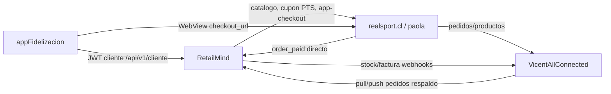
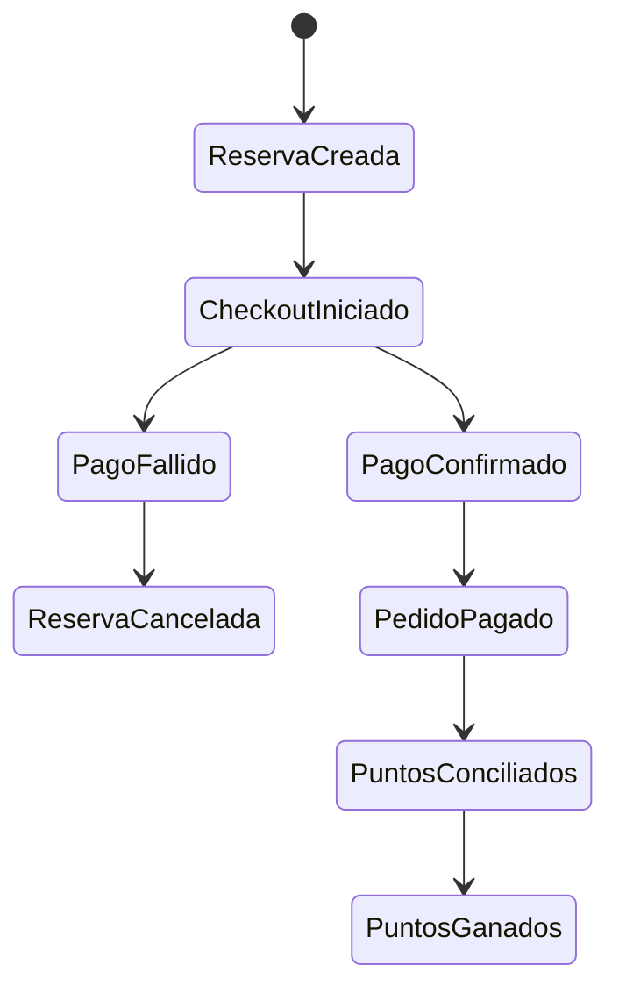

# Comunicacion final: appFidelizacion, RetailMind y ecommerce

Este documento define como se comunica finalmente `appFidelizacion` con
RetailMind y los ecommerces (`realsport.cl` / `calzadospaola.cl`) para consultar
puntos ganados, usar puntos en compras online y cerrar la conciliacion de pago.

## Principio base

`appFidelizacion` no se comunica directo con APIs privadas del ecommerce.

La app habla con RetailMind por `/api/v1/cliente/`. RetailMind es el dueno del
cliente, el saldo, los movimientos de puntos, las reservas, los vales y la
conciliacion. El ecommerce solo recibe instrucciones server-to-server desde
RetailMind y entrega el checkout web para pagar.



## Roles por sistema

### appFidelizacion

- Autentica clientes con OTP y JWT cliente.
- Consulta saldo y movimientos de puntos en RetailMind.
- Consulta catalogo por tienda desde RetailMind.
- Reserva puntos antes de pagar.
- Abre el checkout web del ecommerce en WebView.
- Despues del retorno del WebView, consulta RetailMind para confirmar si la
  reserva/pago ya quedo conciliada.

### RetailMind

- Es la fuente de verdad de puntos.
- Acumula puntos por ventas POS y por pedidos ecommerce facturados.
- Reserva puntos sin debitarlos hasta que el pago este confirmado.
- Genera cupones `PTS-<reserva_id>` en el ecommerce.
- Inicia checkout web del ecommerce.
- Confirma/cancela/expira reservas.
- Recibe aviso directo de pago desde ecommerce.
- Recibe o trae pedidos desde VicentAllConnected como respaldo operativo.

### Ecommerce

- Renderiza catalogo/checkout web y procesa el pago.
- Recibe cupones de puntos creados por RetailMind.
- Marca el pedido como pagado cuando la pasarela confirma.
- Avisa directamente a RetailMind cuando un pedido de app/puntos queda pagado.
- Expone pedidos/productos a VicentAllConnected para operacion omnicanal.

### VicentAllConnected

- Orquesta stock, pedidos y publicaciones entre RetailMind y canales externos.
- Sincroniza pedidos de ecommerce hacia su modelo interno.
- Puede enviar o exponer pedidos pendientes a RetailMind.
- Recibe stock y facturas desde RetailMind con llave compartida.

## Flujo 1: puntos ganados en tienda/POS

1. El cliente se identifica con RUT en caja.
2. RetailMind emite el ticket/boleta.
3. RetailMind ejecuta `acumular_puntos_por_venta(ticket)`.
4. El servicio resuelve el cliente por `ticket.cliente_rut`.
5. Crea un movimiento `ACUMULACION` idempotente con key `acum:<ticket.id>`.
6. Actualiza `CuentaPuntos.saldo_puntos`.
7. `appFidelizacion` refresca:
   - `GET /api/v1/cliente/puntos/saldo/`
   - `GET /api/v1/cliente/puntos/movimientos/`

Resultado: los puntos ganados en RetailMind aparecen en la app sin que el POS
ni la app muevan saldo manualmente.

## Flujo 2: puntos ganados en ecommerce

1. El cliente compra desde `appFidelizacion`.
2. La app inicia el checkout en RetailMind.
3. RetailMind entrega un `checkout_url` del ecommerce.
4. El ecommerce crea el pedido y marca `billing_address.from_app=true`.
5. Cuando el pedido se factura en RetailMind, RetailMind ejecuta:
   - conciliacion de puntos usados si el cupon empieza con `PTS-`;
   - acumulacion de puntos por la parte pagada en dinero si `from_app=true`.
6. La app consulta saldo/movimientos en RetailMind.

Resultado: los puntos ganados por compras ecommerce tambien viven en RetailMind.
La app solo lee el ledger final.

## Flujo 3: uso de puntos en ecommerce

1. La app consulta saldo disponible:
   `GET /api/v1/cliente/puntos/saldo/`.
2. La app cotiza cuanta plata equivalen los puntos:
   `POST /api/v1/cliente/puntos/cotizar/`.
3. La app reserva puntos:
   `POST /api/v1/cliente/puntos/reservar/`.
4. RetailMind crea una `ReservaPuntos` en estado `RESERVADA`.
5. RetailMind crea en el ecommerce un cupon de un solo uso:
   `PTS-<reserva_id>`.
6. La app inicia checkout:
   `POST /api/v1/cliente/checkout/iniciar/`.
7. RetailMind llama server-to-server al ecommerce:
   `POST /api/v1/app-checkout/`.
8. La app abre `checkout_url` en WebView.
9. Si el pago falla o el cliente abandona, la app llama:
   `POST /api/v1/cliente/checkout/cancelar/<reserva_id>/`.
10. Si el pago vuelve como exitoso, la app muestra resultado y consulta:
    `GET /api/v1/cliente/checkout/estado/<reserva_id>/`.

Regla clave: la URL de exito del WebView es solo senal de UX. La confirmacion
real de puntos se obtiene desde RetailMind.

## Cierre rapido del pago ecommerce

Cuando realsport/paola cambia un pedido de app o con cupon `PTS-*` a estado
pagado, encola una tarea Celery que llama a RetailMind:

```http
POST <RETAILMIND_URL>/app/api/ecommerce/pedidos/pagado/
X-RetailMind-Key: <RETAILMIND_API_KEY>
Content-Type: application/json

{
  "canal_origen": "REALSPORT",
  "numero_pedido_canal": "ORD-2026-00001",
  "status": "paid",
  "coupon_code": "PTS-123",
  "from_app": true,
  "discount": "10000.00",
  "total": "39990.00"
}
```

RetailMind usa `canal_origen` + `numero_pedido_canal` para buscar el pedido.
Si aun no fue ingerido, responde OK y la conciliacion queda para la ingesta
posterior. Si ya existe y trae cupon `PTS-*`, confirma la reserva de puntos.

## Seguridad entre servidores

- App movil: JWT cliente, refresh rotativo y storage seguro.
- RetailMind -> ecommerce: API key server-to-server; la app nunca ve esa llave.
- Ecommerce -> RetailMind: `X-RetailMind-Key`.
- RetailMind -> VicentAllConnected: `X-AllConnected-Key`.
- VicentAllConnected valida `X-AllConnected-Key` contra `ALLCONNECTED_API_KEY`
  o la llave configurada en el canal RetailMind.

## Variables a configurar

### appFidelizacion

```bash
BASE_URL=https://retail.webappsolutions.cl/api/v1/cliente/
REALSPORT_URL=https://realsport.cl
PAOLA_URL=https://calzadospaola.cl
```

### realsport.cl / paola

```bash
RETAILMIND_URL=https://retail.webappsolutions.cl
RETAILMIND_API_KEY=<misma llave que valida RetailMind para X-RetailMind-Key>
RETAILMIND_CANAL_ORIGEN=REALSPORT
RETAILMIND_ORDER_PAID_PATH=/app/api/ecommerce/pedidos/pagado/
```

Para Paola:

```bash
RETAILMIND_CANAL_ORIGEN=PAOLA
```

### RetailMind

```bash
ALLCONNECTED_WEBHOOK_URL=https://<vicent-host>/app/sincronizacion-stock/
ALLCONNECTED_API_KEY=<llave compartida con VicentAllConnected>
ALLCONNECTED_API_HEADER_NAME=X-AllConnected-Key
```

Ademas, cada tienda debe tener sus `CredencialesEcommerce` activas para:

- leer catalogo;
- crear/desactivar cupones;
- iniciar checkout web.

### VicentAllConnected

```bash
ALLCONNECTED_API_KEY=<llave compartida con RetailMind/ecommerce>
```

## Estados esperados

### Reserva de puntos

- `RESERVADA`: saldo comprometido, aun no debitado.
- `CONFIRMADA`: pago confirmado; saldo debitado por el descuento real.
- `CANCELADA`: pago fallido o abandono; saldo liberado.
- `EXPIRADA`: TTL vencido; saldo liberado por job/backend.

### Compra app con puntos



## Reglas finales

- La app nunca debita ni suma puntos localmente.
- El saldo visible siempre sale de RetailMind.
- Los puntos usados se reservan antes de pagar y se debitan solo con pago
  confirmado.
- Los puntos ganados se acumulan cuando RetailMind tiene una venta/ticket
  facturado con cliente identificado.
- Si falla una notificacion, el flujo debe ser idempotente y recuperable por
  ingesta/polling posterior.
