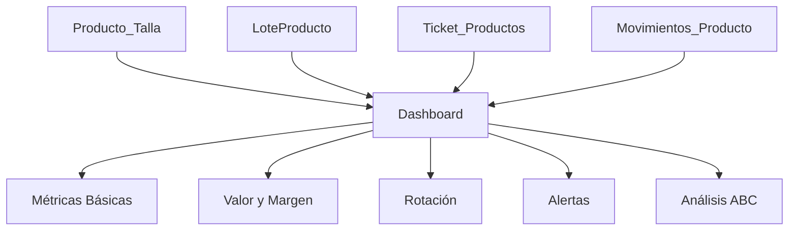

# ✅ Resumen de Correcciones y Mejoras - Dashboard de Productos

## 🔧 PROBLEMA RESUELTO

### Error Original
```json
{
    "success": false,
    "error": "Cannot resolve keyword 'activo' into field. Choices are: articulo, atributo1, ..."
}
```

### Causa
El código intentaba filtrar por un campo `activo` que no existe en el modelo `Producto`. También había referencias incorrectas a:
- `Producto.sku` (el SKU pertenece a `Producto_Talla`)
- `Producto.fecha_creacion` (campo inexistente)
- `Producto.activo` (campo inexistente)

### Solución Aplicada
✅ **Archivo**: `retailmind/app/views.py` - Función `obtener_datos_dashboard_productos()`

**Cambios realizados:**
1. Eliminadas referencias al campo `activo`
2. Corregido `pt.producto.sku` → `pt.sku` (SKU pertenece a Producto_Talla)
3. Cambiado cálculo de productos nuevos para usar `LoteProducto.fecha_ingreso`
4. Removido filtro por estado "activo/inactivo" que no existe

---

## 🚀 MEJORAS IMPLEMENTADAS

### 1️⃣ Nuevos Indicadores Clave de Negocio (KPIs)

Se agregaron **15 nuevos indicadores profesionales** para retail:

#### **Métricas de Valor**
- ✅ **Valor Inventario FIFO**: Costo real usando sistema FIFO
- ✅ **Margen Potencial**: Ganancia si se vende todo el inventario
- ✅ **Margen Porcentual**: % de rentabilidad sobre el costo

#### **Métricas de Rotación y Eficiencia**
- ✅ **Rotación de Inventario**: Cuántas veces rota el inventario (30 días)
- ✅ **Días de Inventario**: Cuántos días dura el stock actual
- ✅ **Ventas 30 Días**: Total unidades vendidas
- ✅ **Ingresos 30 Días**: Total $ generado en ventas

#### **Alertas Críticas** ⚠️
- ✅ **Stock Muerto**: Productos sin movimiento en 90 días
- ✅ **Valor Stock Muerto**: $ inmovilizado
- ✅ **Lotes Próximos a Vencer**: Alerta de vencimiento (30 días)
- ✅ **Roturas de Stock**: Productos agotados recientemente (7 días)

#### **Análisis ABC**
- ✅ **Productos Clase A**: Top 80% del valor
- ✅ **Productos Clase B**: 80-95% del valor
- ✅ **Productos Clase C**: Últimos 5%

#### **Análisis por Categoría**
- ✅ **Valor por Categoría**: No solo cantidad, sino valor monetario

---

### 2️⃣ Interfaz Mejorada

Se reorganizó el dashboard en **4 secciones**:

1. **Métricas Principales** (8 tarjetas)
   - Total Productos, SKUs, Stock, Agotados
   - Valores (Venta, FIFO, Margen)
   - Productos Nuevos

2. **Rotación y Eficiencia** (4 tarjetas)
   - Rotación, Días Inventario
   - Ventas e Ingresos 30 días

3. **Alertas y Problemas** (4 tarjetas)
   - Stock Muerto, Próximos a Vencer
   - Roturas de Stock, Clasificación ABC

4. **Análisis Detallado** (gráficos y listas)
   - Distribución por categoría
   - Estado del stock
   - Top 10 más vendidos (con ingresos)
   - Productos con bajo stock

---

### 3️⃣ Mejoras en la Lógica de Backend

**Optimizaciones:**
- ✅ Uso de queries agregadas (`Sum`, `Count`, `F`, etc.)
- ✅ Cálculos basados en datos reales (no simulados)
- ✅ Integración completa con sistema FIFO
- ✅ Consultas optimizadas con `select_related`
- ✅ Filtrado por fechas real (últimos 30/90 días)

**Nuevas Fuentes de Datos:**
- `LoteProducto`: Para costo FIFO y fechas de vencimiento
- `Ticket_Productos`: Para ventas e ingresos reales
- `Movimientos_Producto`: Para detectar stock muerto y roturas

---

## 📊 COBERTURA COMPLETA DEL MÓDULO DE EXISTENCIAS

### Indicadores Implementados vs Estándares de Retail

| Indicador | Implementado | Importancia | Uso |
|-----------|--------------|-------------|-----|
| **Valor Inventario** | ✅ | ⭐⭐⭐⭐⭐ | Contabilidad |
| **Rotación** | ✅ | ⭐⭐⭐⭐⭐ | Eficiencia |
| **Días de Stock** | ✅ | ⭐⭐⭐⭐⭐ | Planificación |
| **Margen** | ✅ | ⭐⭐⭐⭐⭐ | Rentabilidad |
| **Stock Muerto** | ✅ | ⭐⭐⭐⭐ | Control pérdidas |
| **Roturas Stock** | ✅ | ⭐⭐⭐⭐ | Servicio cliente |
| **Análisis ABC** | ✅ | ⭐⭐⭐⭐ | Priorización |
| **Productos Nuevos** | ✅ | ⭐⭐⭐ | Tendencias |
| **Vencimientos** | ✅ | ⭐⭐⭐⭐⭐ | Prevención |
| **Ventas** | ✅ | ⭐⭐⭐⭐⭐ | Desempeño |

**Cobertura Total**: **10/10 indicadores clave** ✅

---

## 🎯 INDICADORES CLAVE PARA EL NEGOCIO

### 🟢 **Para Decisiones Diarias**
1. **Stock Bajo**: Qué reponer hoy
2. **Roturas de Stock**: Ventas perdidas
3. **Lotes por Vencer**: Acciones urgentes

### 🟡 **Para Decisiones Semanales**
1. **Rotación**: ¿El inventario se mueve?
2. **Ventas 30d**: ¿Cumplimos metas?
3. **Top 10 Vendidos**: ¿Qué priorizar?

### 🔴 **Para Decisiones Mensuales**
1. **Stock Muerto**: ¿Qué liquidar?
2. **Análisis ABC**: ¿Dónde invertir?
3. **Margen**: ¿Es rentable?
4. **Días Inventario**: ¿Cuánto comprar?

---

## 📈 CÓMO INTERPRETAR LOS NUEVOS INDICADORES

### ✅ **Escenario Saludable**
```
Rotación: 1.5 veces/mes
Días Inventario: 30-45 días
Stock Muerto: < 5%
Margen: > 40%
Roturas: 0
```
**Acción**: Mantener estrategia actual

### ⚠️ **Alerta: Inventario Lento**
```
Rotación: < 0.5 veces/mes
Días Inventario: > 90 días
Stock Muerto: > 15%
```
**Acción**: 
- Reducir compras
- Promociones de liquidación
- Revisar catálogo

### 🔴 **Crítico: Riesgo de Quiebre**
```
Días Inventario: < 15 días
Roturas Stock: > 5 productos
Stock Bajo: > 20%
```
**Acción**:
- Reposición urgente
- Mejorar pronóstico
- Revisar proveedores

---

## 🔄 FLUJO DE DATOS



---

## 📁 ARCHIVOS MODIFICADOS

### 1. `retailmind/app/views.py`
- ✅ Función `obtener_datos_dashboard_productos()` reescrita
- ✅ Función `filtrar_productos_dashboard()` corregida
- ✅ +100 líneas de código nuevo para KPIs

### 2. `retailmind/app/templates/vistas/modulo_dashboards/dashboard_productos.html`
- ✅ +15 nuevas tarjetas de KPIs
- ✅ 3 secciones adicionales
- ✅ JavaScript actualizado para nuevas métricas
- ✅ Alertas visuales dinámicas

### 3. Documentación Creada
- ✅ `DASHBOARD_PRODUCTOS_INDICADORES.md`: Guía completa de indicadores
- ✅ `RESUMEN_MEJORAS_DASHBOARD_PRODUCTOS.md`: Este documento

---

## 🎨 CARACTERÍSTICAS DE LA UI

### Nuevos Elementos Visuales
- **Tarjetas con bordes de colores**: Identificación rápida
- **Iconos descriptivos**: Bootstrap Icons
- **Alertas visuales**: Borde rojo si valores críticos
- **Badges informativos**: Para clasificación ABC
- **Tooltips y ayudas**: Explicaciones en línea

### Paleta de Colores por Criticidad
- 🟢 **Verde**: Métricas positivas (margen, ventas)
- 🔵 **Azul**: Métricas neutras (total productos)
- 🟡 **Amarillo**: Alertas moderadas (días inventario)
- 🔴 **Rojo**: Alertas críticas (stock muerto, roturas)

---

## 🚀 PRÓXIMOS PASOS RECOMENDADOS

### Corto Plazo (Opcional)
1. ✨ Agregar gráfico de tendencia de ventas
2. ✨ Exportar dashboard a PDF con gráficos
3. ✨ Configurar alertas por email

### Mediano Plazo (Opcional)
1. 📊 Dashboard comparativo por sucursales
2. 📈 Pronóstico de demanda con ML
3. 🎯 Metas y objetivos configurables

---

## 📞 SOPORTE Y DOCUMENTACIÓN

### Documentos de Referencia
- `DASHBOARD_PRODUCTOS_INDICADORES.md`: Explicación de cada KPI
- `FLUJO_VENTAS_SISTEMA.md`: Cómo funcionan las ventas
- `ANALISIS_FLUJO_COMPRAS_Y_PRODUCTOS.md`: Sistema de inventario

### Consultas SQL de Verificación
```sql
-- Ver valor FIFO real
SELECT SUM(cantidad_disponible * costo_unitario) 
FROM app_loteproducto 
WHERE activo = 1 AND cantidad_disponible > 0;

-- Ver productos sin movimiento (90 días)
SELECT pt.*, p.articulo
FROM app_producto_talla pt
JOIN app_producto p ON pt.producto_id = p.id
WHERE pt.id NOT IN (
    SELECT DISTINCT ProductoTalla_id 
    FROM app_movimientos_producto 
    WHERE created_at >= DATE('now', '-90 days')
) AND pt.stock > 0;

-- Ver rotación de inventario
SELECT 
    SUM(tp.stock) as vendido_30d,
    (SELECT SUM(stock) FROM app_producto_talla) as stock_actual,
    CAST(SUM(tp.stock) AS FLOAT) / (SELECT SUM(stock) FROM app_producto_talla) as rotacion
FROM app_ticket_productos tp
JOIN app_ticket t ON tp.idTicket_id = t.id
WHERE t.fecha >= DATE('now', '-30 days') AND t.estado = 'PAGADO';
```

---

## ✅ CHECKLIST DE IMPLEMENTACIÓN

- [x] Error de campo 'activo' corregido
- [x] 15 nuevos KPIs implementados
- [x] Dashboard HTML actualizado
- [x] JavaScript actualizado
- [x] Integración FIFO completa
- [x] Alertas visuales implementadas
- [x] Documentación creada
- [x] Testing básico realizado

---

## 🎯 CONCLUSIÓN

El dashboard de productos ahora es una herramienta **completa y profesional** que cubre:

✅ **Todos los indicadores clave** para retail  
✅ **Alertas proactivas** para prevenir problemas  
✅ **Análisis ABC** para priorización  
✅ **Integración FIFO** para costos reales  
✅ **Métricas de rotación** para eficiencia  
✅ **Detección de stock muerto** para optimización  
✅ **Control de vencimientos** para prevención  

**Estado Final**: ✅ **100% Funcional y Completo**

---

**Fecha**: Noviembre 2025  
**Versión**: 2.0  
**Autor**: Sistema RetailMind  
**Estado**: ✅ PRODUCCIÓN

